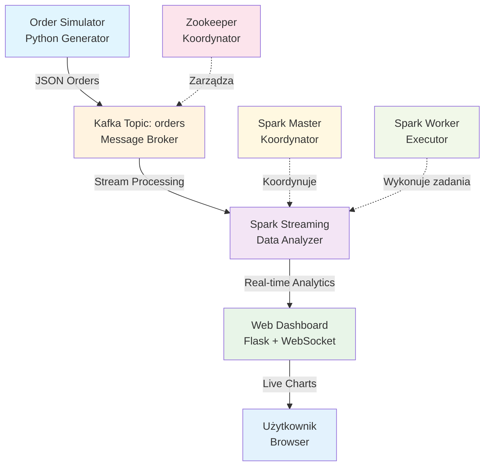
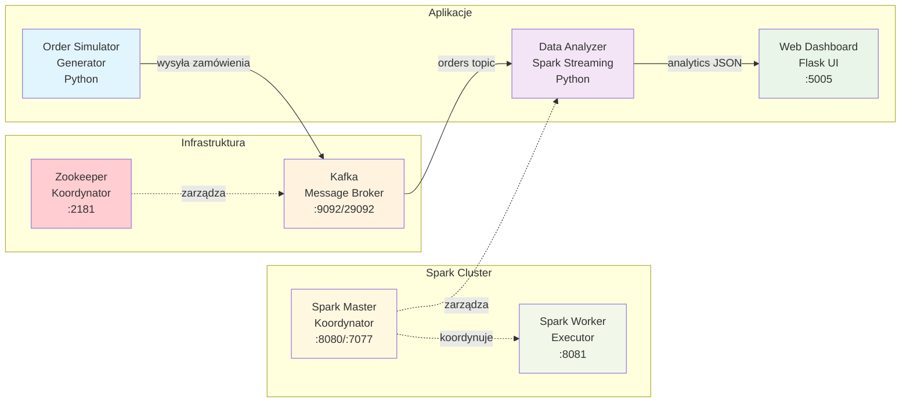
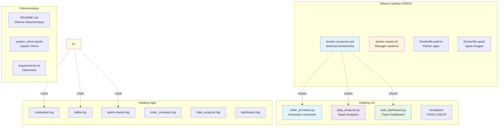
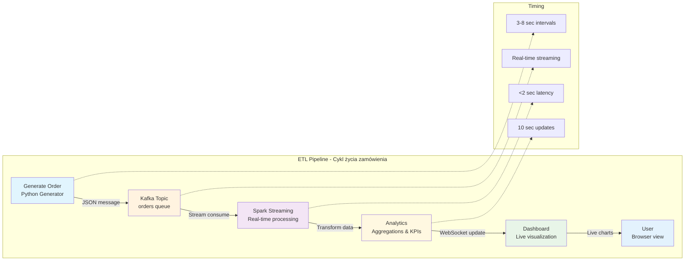

# ASEED - Apache Spark + Kafka E-commerce Analytics

**System analizy zamówień e-commerce w czasie rzeczywistym z Docker**

System symuluje sklep internetowy wysyłający zamówienia przez Kafka, a Spark analizuje które produkty są najpopularniejsze. **Całość działa w kontenerach Docker** dla łatwego wdrożenia i skalowania.

## Architektura systemu - Opis kontenerów

### **Kontenery główne:**

**aseed-zookeeper** 
- **Port:** 2181
- **Rola:** Koordynator klastra Kafka, zarządzanie metadanymi i konfiguracją
- **Zadania:** Wybór lidera partycji, synchronizacja węzłów, przechowywanie konfiguracji Kafka
- **Technologia:** Apache Zookeeper 3.9

**aseed-kafka** 
- **Porty:** 9092 (wewnętrzny), 29092 (zewnętrzny)
- **Rola:** Broker komunikatów - serce systemu streaming
- **Zadania:** Przechowywanie i dystrybucja zamówień w temacie 'orders', zarządzanie kolejkami
- **Technologia:** Apache Kafka 2.13-3.9.0

**aseed-spark-master**
- **Porty:** 8080 (UI), 7077 (cluster)
- **Rola:** Koordynator przetwarzania dużych danych
- **Zadania:** Zarządzanie workerami, planowanie zadań, Spark UI dashboard
- **Technologia:** Apache Spark 3.5.6 z Hadoop 3

**aseed-spark-worker**
- **Port:** 8081 (UI)
- **Rola:** Executor zadań przetwarzania danych
- **Zadania:** Wykonywanie obliczeń analitycznych, przetwarzanie strumieni danych
- **Zasoby:** 1 core, 1GB pamięci per worker

### **Kontenery aplikacyjne:**

**aseed-order-simulator**
- **Rola:** Generator realistycznych zamówień e-commerce
- **Zadania:** Tworzenie zamówień testowych, wysyłanie do Kafka, symulacja ruchu handlowego
- **Produkty:** 60 produktów w 6 kategoriach (Elektronika, Odzież, Książki, Dom, Sport, Uroda)
- **Częstotliwość:** 3-8 sekund między zamówieniami

**aseed-data-analyzer**
- **Rola:** Procesor analityczny danych biznesowych (Spark Streaming)
- **Zadania:** Analiza trendów sprzedaży, wykrywanie wzorców, generowanie metryk KPI
- **Algorytmy:** Top produkty, analiza kategorii, segmentacja czasowa
- **Output:** JSON z wynikami analiz do dashboard

**aseed-web-dashboard**
- **Port:** 5005
- **Rola:** Interfejs webowy do monitorowania systemu
- **Zadania:** Dashboard w czasie rzeczywistym, wykresy, monitoring kontenerów Docker
- **Technologia:** Flask + WebSocket + Chart.js
- **API (GET):** `/api/status`, `/api/service-status`, `/api/dashboard_data`
- **API (POST – wewnętrzne od Spark):** `/api/top_products`, `/api/categories`, `/api/raw_orders`

## Przepływ danych w systemie



### Szczegółowy przepływ przetwarzania:
```
[Order Simulator] → [Kafka Topic 'orders'] → [Spark Streaming] → [Dashboard]
     (Python)           (Message Broker)       (Data Analysis)     (Flask UI)
        ↓                       ↓                      ↓               ↓
   JSON Orders         Stream Processing      Real-time Analytics  Live Charts
```

## Quick Start

### 1. Wymagania
- Docker 20.10+ 
- Docker Compose v2+
- 4GB RAM wolnego
- Porty: 5005, 8080, 9092, 2181

### 2. Instalacja i uruchomienie
```bash
git clone https://github.com/NatanTulo/ASEED.git
cd ASEED

# Jednorazowa instalacja i konfiguracja
./docker-aseed.sh install

# Uruchom cały system (7 kontenerów)
./docker-aseed.sh start
```

### 3. Dostęp do systemu
- **Dashboard**: http://localhost:5005 - Główny interface użytkownika
- **Spark UI**: http://localhost:8080 - Monitoring przetwarzania danych
- **Kafka**: localhost:9092 - Broker komunikatów

### 4. Zarządzanie systemem
```bash
# Status wszystkich kontenerów
./docker-aseed.sh status

# Logi całego systemu
./docker-aseed.sh logs

# Logi konkretnego serwisu
./docker-aseed.sh logs web-dashboard
./docker-aseed.sh logs kafka

# Restart konkretnego serwisu
./docker-aseed.sh restart-service kafka

# Zatrzymanie systemu
./docker-aseed.sh stop

# Czyszczenie (usuń kontenery i obrazy)
./docker-aseed.sh cleanup
```

## Architektura kontenerowa Docker



### Tradycyjna architektura ASCII:
```
┌─────────────────┐   ┌─────────────────┐   ┌─────────────────┐
│   Zookeeper     │──▶│     Kafka       │──▶│  Order Simulator│
│  (Koordynator)  │   │ (Message Broker)│   │(Generator danych)│
└─────────────────┘   └─────────────────┘   └─────────────────┘
                              │
                              ▼ (Topic: orders)
┌─────────────────┐   ┌─────────────────┐   ┌─────────────────┐
│  Spark Master   │──▶│ Data Analyzer   │──▶│  Web Dashboard  │
│ (Koordynator)   │   │(Spark Streaming)│   │  (Flask UI)     │
└─────────────────┘   └─────────────────┘   └─────────────────┘
         │                       
         ▼                       
┌─────────────────┐              
│  Spark Worker   │              
│   (Executor)    │              
└─────────────────┘              
```

## Format danych zamówień

Każde zamówienie w systemie ma następującą strukturę JSON:

```json
{
  "order_id": "ORDER-000001",
  "product_id": "PROD-001", 
  "product_name": "Wireless Bluetooth Headphones",
  "category": "Electronics",
  "price": 79.99,
  "quantity": 2,
  "customer_id": "CUST-0842",
  "timestamp": "2025-09-06T14:30:00.123456"
}
```

### Kategorie produktów i ceny:
- **Electronics** ($24.99 - $649.99): Smart TV, Słuchawki, Kamery, Telefony
- **Clothing** ($19.99 - $159.99): T-shirty, Jeansy, Kurtki, Buty  
- **Books** ($12.99 - $49.99): Powieści, Poradniki programowania, Albumy
- **Home & Garden** ($9.99 - $199.99): Meble, Dekoracje, Narzędzia
- **Sports** ($14.99 - $299.99): Sprzęt fitness, Odzież sportowa
- **Beauty** ($8.99 - $89.99): Kosmetyki, Perfumy, Produkty pielęgnacyjne

## System logowania

System automatycznie zapisuje logi wszystkich kontenerów do osobnych plików w katalogu `logs/`:

```
logs/
├── zookeeper.log           # Logi koordynatora Kafka
├── kafka.log               # Logi message broker 
├── spark-master.log        # Logi koordynatora Spark
├── spark-worker.log        # Logi executora Spark
├── order_simulator.log     # Logi generatora zamówień
├── data_analyzer.log       # Logi procesora analitycznego
└── dashboard.log           # Logi interfejsu webowego
```

### Kolorowe wyświetlanie

Logi są automatycznie kolorowane dla lepszej czytelności:
- **Czerwony**: Błędy (ERROR, EXCEPTION, FAILED)
- **Żółty**: Ostrzeżenia (WARNING, WARN)  
- **Zielony**: Informacje (INFO, SUCCESS, OK, STARTED)
- **Biały**: Pozostałe komunikaty

### Automatyczne rotacje logów

Każdy kontener ma skonfigurowaną rotację logów Docker:
- **Maksymalny rozmiar**: 10MB per plik
- **Liczba plików**: 3 kopie zapasowe
- **Automatyczne czyszczenie** starych logów

## Struktura systemu



### Klasyczna struktura plików:

```
ASEED/
├── docker-compose.yml           # Definicja wszystkich kontenerów
├── docker-aseed.sh             # Skrypt zarządzający systemem
├── Dockerfile.python           # Obraz dla aplikacji Python
├── Dockerfile.spark            # Obraz Spark Master
├── Dockerfile.spark-app        # Obraz aplikacji analitycznych
├── src/
│   ├── order_simulator.py          # Generator zamówień
│   ├── data_analyzer.py            # Spark Structured Streaming
│   ├── web_dashboard.py            # Dashboard Flask + WebSocket
│   └── templates/dashboard.html    # Interfejs web HTML/JS
├── system_demo.ipynb         # Notebook demonstracyjny Jupyter
├── logs/                      # Automatyczne logi kontenerów
│   ├── zookeeper.log             # Logi Zookeeper
│   ├── kafka.log                 # Logi Kafka broker
│   ├── spark-master.log          # Logi Spark Master
│   ├── spark-worker.log          # Logi Spark Worker  
│   ├── order_simulator.log       # Logi generatora zamówień
│   ├── data_analyzer.log         # Logi analizatora Spark
│   └── dashboard.log             # Logi dashboard Flask
├── requirements.txt           # Zależności Python
```

## Funkcjonalność systemu

### Real-time Analytics
- **Top produkty** - Ranking najpopularniejszych produktów w czasie rzeczywistym
- **Analiza kategorii** - Sprzedaż według kategorii produktów
- **Trendy czasowe** - Wzorce zamówień w różnych okresach
- **Metryki KPI** - Średnia wartość zamówienia, liczba transakcji

### Monitoring i zarządzanie
- **Status kontenerów** - Monitorowanie wszystkich serwisów Docker
- **Metryki wydajności** - CPU, RAM, throughput systemu
- **Logi centralne** - Agregacja logów z wszystkich kontenerów
- **Health checks** - Automatyczne sprawdzanie zdrowia serwisów

### API i interfejsy
- **Dashboard Web** - http://localhost:5005 (Flask + WebSocket)
- **Spark UI** - http://localhost:8080 (Monitoring klastra Spark)
- **REST API** - patrz sekcja API poniżej
- **Jupyter Demo** - `system_demo.ipynb` z kompletną demonstracją

## Komendy Docker i debugging

### Podstawowe monitoring
```bash
# Status wszystkich kontenerów ASEED
./docker-aseed.sh status

# Metryki zasobów systemowych
docker stats

# Sprawdzenie sieci kontenerów
docker network ls | grep aseed
```

### Debugging kontenerów
```bash
# Sprawdzenie logów kontenera
docker logs aseed-kafka --tail 50
docker logs aseed-data-analyzer --follow

# Wejście do kontenera dashboard
docker exec -it aseed-web-dashboard /bin/bash

# Restart konkretnego serwisu  
./docker-aseed.sh restart-service kafka
./docker-aseed.sh restart-service spark-master

# Test połączenia z Kafka
docker exec -it aseed-kafka kafka-topics --list --bootstrap-server localhost:9092
```

### Podgląd danych (generator działa automatycznie w kontenerze order-simulator)
```bash
# Sprawdzenie konsumentem Kafka (przegląd surowych wiadomości)
docker exec -it aseed-kafka kafka-console-consumer --topic orders --from-beginning --bootstrap-server localhost:9092
```

## Wyniki i metryki systemu



System zgodny z wymaganiami Apache Spark + Kafka:

### ETL Pipeline
- **Extract**: Kafka Consumer pobiera zamówienia z topic 'orders'
- **Transform**: Spark Structured Streaming przetwarza dane w czasie rzeczywistym  
- **Load**: Wyniki zapisywane do pamięci + JSON API dla Dashboard

### Key Performance Indicators (KPI)
- **Throughput**: 10-50 zamówień/minutę (konfigurowalne)
- **Latencja**: <2 sekundy od zamówienia do wyników
- **Top Products**: Aktualizowane co 10 sekund
- **Category Analytics**: Ranking kategorii produktów
- **Revenue Tracking**: Łączna wartość sprzedaży w czasie rzeczywistym

### Technologie użyte
- **Apache Kafka 2.13-3.9.0** - Message streaming
- **Apache Spark 3.5.6** - Structured Streaming + Analytics
- **Apache Zookeeper 3.9** - Kafka coordination
- **Flask 2.3** - Web dashboard + REST API
- **Docker & Docker Compose** - Containerization
- **Python 3.11** - Aplikacje biznesowe

## Rozwiązywanie problemów

### Typowe problemy i rozwiązania

**1. Port już zajęty**
```bash
# Zatrzymaj system i sprawdź porty
./docker-aseed.sh stop
netstat -tulpn | grep :5005
sudo lsof -i :9092
```

**2. Kontener nie startuje**
```bash
# Sprawdź logi błędów
docker logs aseed-kafka
docker logs aseed-spark-master
./docker-aseed.sh logs web-dashboard
```

**3. Brak danych w dashboard**
```bash  
# Sprawdź czy Kafka topic został utworzony
docker exec -it aseed-kafka kafka-topics --list --bootstrap-server localhost:9092

# Test producer/consumer
docker exec -it aseed-kafka kafka-console-producer --topic orders --bootstrap-server localhost:9092
```

**4. Błędy pamięci**
```bash
# Zwiększ pamięć Docker Desktop do min 4GB
# Sprawdź wykorzystanie zasobów
docker stats
./docker-aseed.sh status
```

**5. Kompletny reset systemu**
```bash
# Czyszczenie wszystkich kontenerów i obrazów
./docker-aseed.sh cleanup
docker system prune -a --volumes
./docker-aseed.sh install
```

## API (aktualne)

Typ | Metoda | Endpoint | Opis
----|--------|----------|-----
Public | GET | `/api/status` | Podstawowe metryki (liczba zamówień, przychód, throughput)
Public | GET | `/api/service-status` | Status wszystkich serwisów Docker
Public | GET | `/api/dashboard_data` | Zbiorczy snapshot (produkty, kategorie, ostatnie zamówienia, metryki)
Wewnętrzne (Spark) | POST | `/api/top_products` | Dane top produktów (push ze Spark)
Wewnętrzne (Spark) | POST | `/api/categories` | Agregacje kategorii (push ze Spark)
Wewnętrzne (Spark) | POST | `/api/raw_orders` | Ostatnie zamówienia (push batch ze Spark)

Przykłady:
```bash
curl http://localhost:5005/api/status
curl http://localhost:5005/api/service-status
curl http://localhost:5005/api/dashboard_data
```

Endpointy POST są wywoływane automatycznie przez moduł `data_analyzer.py` – nie należy ich manualnie odpytywać.