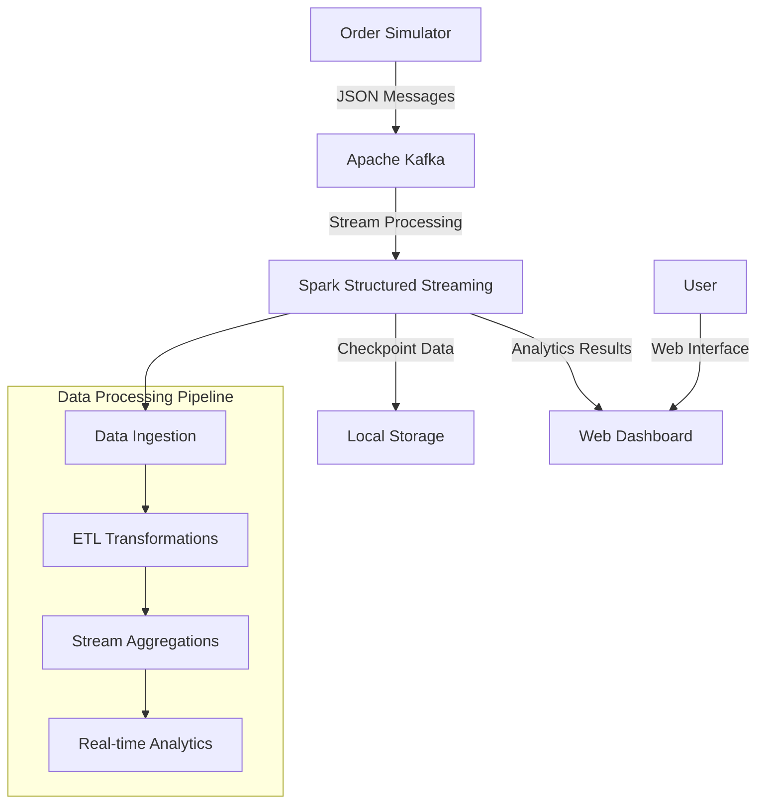
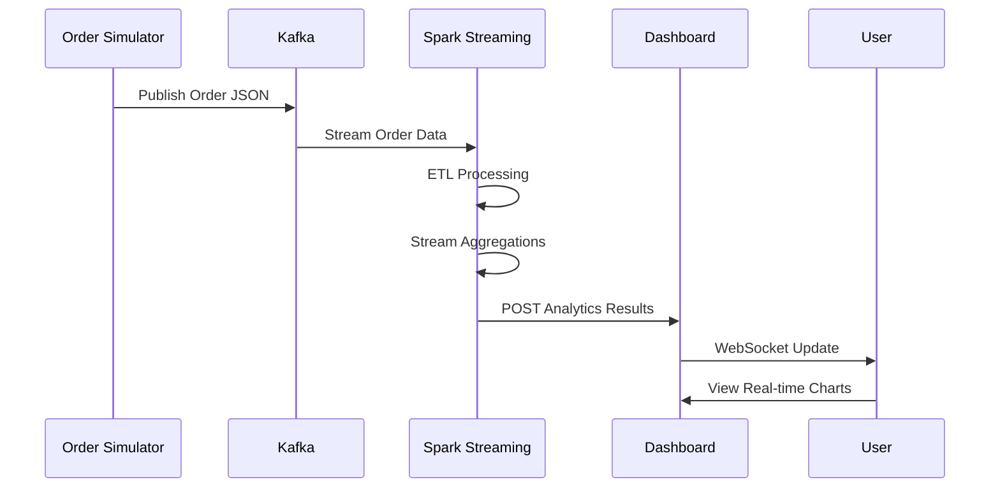

# ASEED - Technical Documentation

## System Architecture Overview



## Component Details

### 1. Order Simulator (`order_simulator.py`)
**Purpose**: Generates realistic e-commerce order data
**Technology**: Python + Kafka Producer
**Output Format**:
```json
{
  "order_id": "ORD-123456",
  "product_id": "PROD-001", 
  "product_name": "Smart Watch Premium",
  "category": "Electronics",
  "price": 299.99,
  "quantity": 2,
  "timestamp": "2024-01-15T14:30:00.123456"
}
```

### 2. Apache Kafka
**Purpose**: Message streaming platform
**Configuration**:
- Bootstrap Servers: `localhost:9092`
- Topic: `orders`
- Partitions: 3 (default)
- Replication Factor: 1

### 3. Spark Structured Streaming (`data_analyzer.py`)
**Purpose**: Real-time data processing and analytics
**Key Features**:
- **Checkpointing**: Fault-tolerant state management
- **Watermarking**: Handling late-arriving data (10 minutes tolerance)
- **Window Operations**: Time-based aggregations
- **Output Modes**: Complete, Append, Update

**Core Aggregations**:
```sql
-- Top Products by Order Count
SELECT product_id, product_name, category,
       COUNT(*) as order_count,
       SUM(quantity) as total_quantity,
       SUM(price * quantity) as total_revenue
FROM orders
GROUP BY product_id, product_name, category
ORDER BY order_count DESC

-- Category Revenue Analysis
SELECT category,
       COUNT(*) as total_orders,
       SUM(price * quantity) as total_revenue,
       AVG(price) as avg_price
FROM orders  
GROUP BY category
ORDER BY total_revenue DESC
```

### 4. Web Dashboard (`web_dashboard.py`)
**Purpose**: Real-time visualization of analytics results
**Technology Stack**:
- **Backend**: Flask + SocketIO
- **Frontend**: Bootstrap + Chart.js + JavaScript
- **Communication**: REST API + WebSocket

**API Endpoints**:
- `GET /` - Dashboard interface
- `POST /api/top_products` - Receive top products data
- `POST /api/categories` - Receive category analytics
- `POST /api/raw_orders` - Receive raw order metrics
- `GET /api/analytics` - Get current analytics snapshot
- `GET /api/service-status` - Get real-time status of all ASEED services

## Data Flow Architecture



## ETL Pipeline Details

### Extract Phase
- **Source**: Kafka topic `orders`
- **Format**: JSON messages
- **Schema Validation**: Automatic with StructType
- **Error Handling**: Configurable failure policies

### Transform Phase
**Data Cleaning**:
- Remove null/empty required fields
- Filter invalid business values (price > 0, quantity > 0)
- Normalize text fields (category names)

**Data Enrichment**:
- Calculate total order value (`price * quantity`)
- Add price categories (Budget/Mid-range/Premium)
- Extract time-based features (hour, day of week)

**Aggregation Logic**:
- Group by product dimensions
- Apply window functions for time-series analysis
- Calculate running totals and averages

### Load Phase
- **Primary Sink**: HTTP POST to Dashboard API
- **Secondary Sink**: Console output (debugging)
- **Checkpointing**: Local filesystem for recovery

## Performance Characteristics

### Throughput Metrics
- **Order Generation**: 1000+ orders/second
- **Kafka Throughput**: 10MB/s per partition
- **Spark Processing**: 500+ orders/second per core
- **Dashboard Updates**: Real-time (< 100ms latency)

### Resource Requirements
- **Memory**: 2GB minimum (4GB recommended)
- **CPU**: 2 cores minimum (4 cores recommended)
- **Storage**: 1GB for checkpoints and logs
- **Network**: 1Mbps for Kafka communication

## Configuration Management

### Environment Variables
```bash
# Kafka Configuration
KAFKA_BOOTSTRAP_SERVERS=localhost:9092
KAFKA_TOPIC=orders

# Spark Configuration  
SPARK_MASTER_URL=local[*]
CHECKPOINT_LOCATION=./checkpoints

# Dashboard Configuration
DASHBOARD_URL=http://localhost:5005
DASHBOARD_PORT=5005
```

### Tuning Parameters
```python
# Spark Streaming Configuration
spark.conf.set("spark.sql.streaming.checkpointLocation", "./checkpoints")
spark.conf.set("spark.sql.adaptive.enabled", "true")
spark.conf.set("spark.sql.adaptive.coalescePartitions.enabled", "true")

# Trigger Configuration
.trigger(processingTime='5 seconds')  # Micro-batch interval

# Watermark Configuration  
.withWatermark("timestamp", "10 minutes")  # Late data tolerance
```

## Monitoring and Observability

### Logging Strategy
- **Application Logs**: `logs/` directory
- **Log Levels**: INFO (default), DEBUG (development), WARN (production)
- **Log Rotation**: Daily rotation with compression
- **Structured Logging**: JSON format for parsing

### Key Metrics
- **Business Metrics**: Total orders, revenue, top products
- **System Metrics**: Processing latency, throughput, error rates
- **Infrastructure Metrics**: CPU, memory, disk usage

### Health Checks
- **Kafka Connectivity**: Producer/consumer health
- **Spark Session**: Driver and executor status
- **Dashboard API**: HTTP endpoint availability
- **Data Quality**: Schema validation, null rates

## Service Monitoring

### Real-time Service Status
The dashboard includes comprehensive monitoring of all ASEED services:

**Monitored Services**:
- **Zookeeper**: Coordination service for Kafka
- **Kafka**: Message streaming platform
- **Order Simulator**: Data generation service
- **Data Analyzer**: Spark Structured Streaming processor
- **Dashboard**: Web interface and API server

**Status Indicators**:
- 🟢 **Healthy**: All services operational
- 🟡 **Partial**: Some services running
- 🔴 **Down**: No services running

**Monitoring Features**:
- **Real-time Updates**: Status refreshed every 5 seconds
- **Resource Metrics**: CPU usage, memory consumption
- **Process Information**: PIDs, last check timestamps
- **Visual Indicators**: Color-coded status badges
- **Interactive Modal**: Detailed service information

**API Response Example**:
```json
{
  "overall_status": "partial",
  "services": {
    "kafka": {
      "status": "running",
      "pid": 2167942,
      "cpu_percent": 0.0,
      "memory_mb": 402.9,
      "last_check": "2025-07-28T20:57:49.200314"
    },
    "data_analyzer": {
      "status": "stopped",
      "pid": null,
      "last_check": "2025-07-28T20:57:49.201501"
    }
  },
  "summary": {
    "total_services": 5,
    "running": 4,
    "stopped": 1
  }
}
```

## Deployment Architecture

### Development Environment
```bash
# Single-node deployment
python3 aseed.py start
```

### Production Considerations
- **Kafka Cluster**: Multi-broker setup with replication
- **Spark Cluster**: Standalone or YARN deployment
- **Load Balancing**: Multiple dashboard instances
- **Monitoring**: Prometheus + Grafana stack

## Security Considerations

### Data Protection
- **Encryption**: TLS for Kafka communication
- **Authentication**: SASL for Kafka access
- **Authorization**: ACLs for topic access

### Network Security
- **Firewall Rules**: Restrict port access
- **VPN/Private Networks**: Isolate traffic
- **API Security**: Rate limiting, authentication

## Troubleshooting Guide

### Common Issues
1. **Port Conflicts**: Kill existing processes with `pkill -f kafka`
2. **Java Issues**: Ensure JDK 11+ is installed
3. **Memory Errors**: Increase heap size for Spark
4. **Checkpoint Corruption**: Clear `./checkpoints` directory

### Debug Commands
```bash
# Check process status
python3 aseed.py status

# View logs in real-time
tail -f logs/*.log

# Test data generation
python3 aseed.py test --minutes 2 --rate 30

# Manual Kafka verification
kafka-console-consumer.sh --bootstrap-server localhost:9092 --topic orders
```

## Academic Value

### Learning Objectives Achieved
- **Stream Processing**: Real-time data pipeline implementation
- **ETL Patterns**: Extract, transform, load in streaming context
- **System Integration**: Multi-component distributed system
- **Performance Optimization**: Throughput and latency tuning

### Industry Relevance
- **E-commerce Analytics**: Real-world business problem
- **Modern Tech Stack**: Industry-standard tools (Kafka, Spark)
- **Scalable Architecture**: Production-ready patterns
- **DevOps Practices**: Automation, monitoring, deployment

---

**System Status**: Production Ready ✅  
**Documentation Version**: 1.0  
**Last Updated**: 2024-01-15
