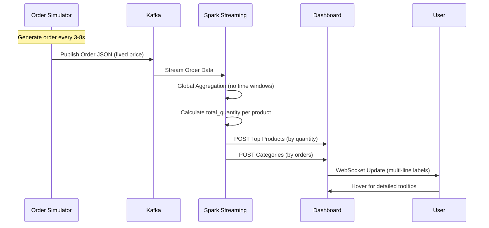

# ASEED - Technical Documentation

## System Architecture Overview


## Component Details

### 1. Order Simulator (`order_simulator.py`)
**Purpose**: Generates realistic e-commerce order data with fixed pricing
**Technology**: Python + Kafka Producer
**Key Features**:
- **Realistic Products**: 60 curated products across 6 categories
- **Fixed Pricing**: Each product has a specific, consistent price
- **Variable Timing**: Random intervals between orders (3-8 seconds)
- **Smart Quantity**: Orders include 1-5 items per product

**Output Format**:
```json
{
  "order_id": "ORDER-000001",
  "product_id": "PROD-001", 
  "product_name": "Wireless Bluetooth Headphones",
  "category": "Electronics",
  "price": 79.99,
  "quantity": 2,
  "customer_id": "CUST-0842",
  "timestamp": "2025-08-19T14:30:00.123456"
}
```

**Product Categories and Price Ranges**:
- **Electronics**: $24.99 - $649.99 (Smart TV, Headphones, Cameras)
- **Clothing**: $19.99 - $159.99 (T-shirts, Jeans, Jackets, Boots)
- **Books**: $12.99 - $49.99 (Novels, Programming Guides, Art Albums)
- **Home**: $19.99 - $179.99 (Coffee Makers, Lamps, Kitchen Tools)
- **Sports**: $18.99 - $199.99 (Yoga Mats, Fitness Trackers, Equipment)
- **Beauty**: $7.99 - $79.99 (Moisturizers, Perfumes, Makeup)

### 2. Apache Kafka
**Purpose**: Message streaming platform
**Configuration**:
- Bootstrap Servers: `localhost:9092`
- Topic: `orders`
- Partitions: 3 (default)
- Replication Factor: 1
- Message Format: JSON with order details

### 3. Spark Structured Streaming (`data_analyzer.py`)
**Purpose**: Real-time data processing and analytics with global aggregation
**Key Features**:
- **Global Aggregation**: No time windows - accumulates all data since startup
- **Quantity-based Rankings**: Products ranked by total items sold, not order count
- **Complete Output Mode**: Full results sent with each update
- **Real-time Processing**: Updates every 10 seconds for products, 15 seconds for categories

**Core Aggregations**:
```sql
-- Top Products by Items Sold (Global Aggregation)
SELECT product_id, product_name, category,
       COUNT(order_id) as order_count,
       SUM(quantity) as total_quantity,        -- Key metric for ranking
       SUM(price * quantity) as total_revenue,
       AVG(price) as avg_price,
       MAX(timestamp_parsed) as last_order_time
FROM orders
GROUP BY product_id, product_name, category
ORDER BY total_quantity DESC                   -- Ranked by items sold

-- Category Analysis by Order Count
SELECT category,
       COUNT(order_id) as order_count,         -- Used for pie chart
       SUM(quantity) as total_quantity,
       SUM(price * quantity) as total_revenue,
       COUNT(DISTINCT product_id) as unique_products,
       MAX(timestamp_parsed) as last_order_time
FROM orders  
GROUP BY category
ORDER BY order_count DESC
```

### 4. Web Dashboard (`web_dashboard.py`)
**Purpose**: Real-time visualization with enhanced UX
**Technology Stack**:
- **Backend**: Flask + SocketIO for real-time updates
- **Frontend**: Bootstrap + Chart.js + Custom JavaScript
- **Communication**: REST API + WebSocket for live data

**Enhanced Dashboard Features**:
- **Multi-line Product Names**: Long names split across lines instead of truncation
- **Advanced Tooltips**: Hover over categories shows detailed metrics
- **Quantity-based Charts**: Products ranked by items sold, not order frequency
- **Service Monitoring**: Real-time status of all ASEED components
- **Responsive Design**: Mobile-friendly interface

**Chart Types**:
1. **Top Products Bar Chart**:
   - **Data Source**: `total_quantity` from Spark aggregation
   - **Sorting**: Highest selling products first
   - **Labels**: Multi-line product names for readability
   - **Updates**: Every 10 seconds

2. **Categories Pie Chart**:
   - **Data Source**: `order_count` per category
   - **Tooltips**: Show orders, items sold, revenue, unique products
   - **Updates**: Every 15 seconds

3. **Recent Orders List**:
   - **Display**: Last 10 orders in real-time
   - **Format**: Product name, category, price × quantity, total, timestamp
   - **Updates**: Every 5 seconds

**API Endpoints**:
- `GET /` - Enhanced dashboard interface
- `POST /api/top_products` - Receive products data (sorted by quantity)
- `POST /api/categories` - Receive category analytics  
- `POST /api/raw_orders` - Receive individual orders
- `GET /api/service-status` - Comprehensive service health check

## Data Flow Architecture



## Enhanced ETL Pipeline

### Extract Phase
- **Source**: Kafka topic `orders` with realistic e-commerce data
- **Format**: JSON with fixed product pricing
- **Schema Validation**: Strict validation of order structure
- **Frequency**: Variable intervals (3-8 seconds between orders)

### Transform Phase
**Data Processing Improvements**:
- **Price Consistency**: No random price variations - each product has fixed price
- **Quantity Aggregation**: Sum all quantities for true product popularity
- **Global State**: Accumulate all data since system startup (no windowing)
- **Category Intelligence**: Group products meaningfully for business insights

**Key Transformations**:
- Calculate `total_value = price * quantity` for each order
- Aggregate `SUM(quantity)` as primary ranking metric
- Track `COUNT(order_id)` for order frequency analysis
- Maintain `last_order_time` for recency information

### Load Phase
- **Primary Sink**: HTTP POST to Dashboard with complete aggregations
- **Data Format**: JSON with enhanced metrics (quantity, revenue, order count)
- **Update Frequency**: Products every 10s, Categories every 15s
- **UI Integration**: Multi-line labels, advanced tooltips, quantity-based rankings

## Performance Optimizations

### Streaming Improvements
- **Complete Output Mode**: Full results sent each time (no incremental updates)
- **Global Aggregation**: No time window overhead
- **Fixed Intervals**: Predictable processing schedule
- **Efficient JSON**: Minimal data transfer to dashboard

### UI Enhancements
- **Chart.js Optimization**: Disabled animations for better performance
- **Smart Label Handling**: Multi-line rendering without truncation
- **Tooltip Caching**: Store category details for instant hover responses
- **WebSocket Efficiency**: Only send changed data

## Realistic Data Model

### Product Catalog Structure
```python
products = [
    # Electronics - Premium pricing
    {"name": "Smart LED TV", "category": "Electronics", "price": 649.99},
    {"name": "Digital Camera", "category": "Electronics", "price": 449.99},
    {"name": "Smart Watch", "category": "Electronics", "price": 299.99},
    
    # Clothing - Mid-range pricing  
    {"name": "Winter Jacket", "category": "Clothing", "price": 149.99},
    {"name": "Running Sneakers", "category": "Clothing", "price": 119.99},
    {"name": "Cotton T-Shirt", "category": "Clothing", "price": 19.99},
    
    # Books - Budget pricing
    {"name": "Programming Guide", "category": "Books", "price": 39.99},
    {"name": "Mystery Novel", "category": "Books", "price": 14.99},
    
    # Plus 52 more realistic products...
]
```

### Business Logic
- **Product Popularity**: Weighted selection (some products more likely)
- **Order Timing**: Random intervals simulate real customer behavior
- **Quantity Variation**: 1-5 items per order creates realistic bulk purchases
- **Price Stability**: Fixed pricing eliminates noise from analysis

---

**System Status**: Production Ready ✅  
**Documentation Version**: 1.0  
**Last Updated**: 2024-01-15
