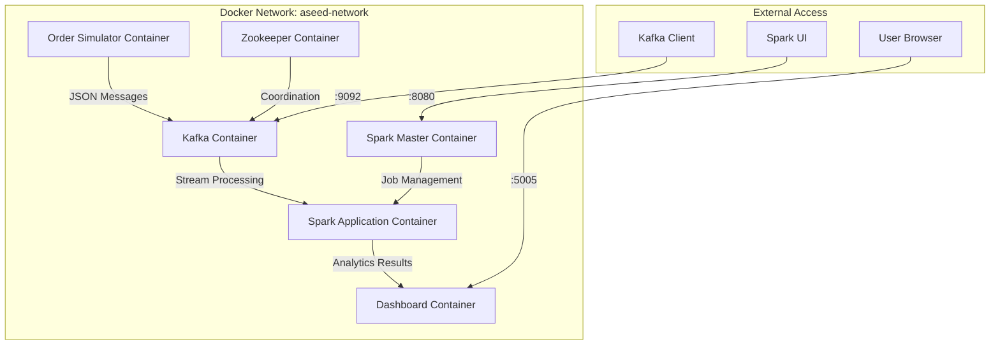

# ASEED - Dokumentacja Techniczna (Docker Edition)

## 🐳 Przegląd architektury kontenerowej

ASEED to system analizy zamówień e-commerce w czasie rzeczywistym zbudowany w architekturze mikroserwisów z wykorzystaniem kontenerów Docker.



## 🔧 Komponenty kontenerowe

### 1. Zookeeper Container (`aseed-zookeeper`)
- **Image**: `confluentinc/cp-zookeeper:7.4.0`
- **Purpose**: Koordynacja i konfiguracja Kafka
- **Porty**: 2181
- **Health Check**: Sprawdzanie połączenia na porcie 2181

### 2. Kafka Container (`aseed-kafka`)
- **Image**: `confluentinc/cp-kafka:7.4.0`
- **Purpose**: Message broker dla zamówień
- **Porty**: 9092 (external), 29092 (internal)
- **Dependencies**: Zookeeper
- **Health Check**: Sprawdzanie Kafka API

### 3. Spark Master Container (`aseed-spark-master`)
- **Image**: Custom `Dockerfile.spark` (based on bitnami/spark:3.5.0)
- **Purpose**: Zarządzanie klastrem Spark
- **Porty**: 8080 (UI), 7077 (master)
- **Volumes**: `/opt/spark-apps`, `/opt/spark-logs`

### 4. Order Simulator Container (`aseed-order-simulator`)
- **Image**: Custom `Dockerfile.python` (Python 3.11)
- **Purpose**: Generowanie realistycznych zamówień e-commerce
- **Command**: `python src/order_simulator.py`
- **Environment Variables**:
  - `KAFKA_BOOTSTRAP_SERVERS=kafka:29092`
  - `KAFKA_TOPIC=orders`
  - `MIN_ORDER_INTERVAL=3`
  - `MAX_ORDER_INTERVAL=8`

### 5. Data Analyzer Container (`aseed-data-analyzer`)
- **Image**: Custom `Dockerfile.spark-app` (Spark + Python)
- **Purpose**: Spark Structured Streaming analytics
- **Command**: `python src/data_analyzer.py`
- **Dependencies**: Kafka, Spark Master
- **Environment Variables**:
  - `KAFKA_BOOTSTRAP_SERVERS=kafka:29092`
  - `SPARK_MASTER_URL=spark://spark-master:7077`

### 6. Web Dashboard Container (`aseed-web-dashboard`)
- **Image**: Custom `Dockerfile.python`
- **Purpose**: Real-time web interface
- **Porty**: 5005
- **Command**: `python src/web_dashboard.py`
- **Environment Variables**:
  - `FLASK_HOST=0.0.0.0`
  - `FLASK_PORT=5005`

## 📦 Docker Images

### Dockerfile.python
```dockerfile
FROM python:3.11-slim
# Installuje podstawowe zależności Python
# Kopiuje kod źródłowy z src/
# Używany przez: order-simulator, web-dashboard
```

### Dockerfile.spark
```dockerfile
FROM bitnami/spark:3.5.0
# Dodaje pakiety Python dla Spark
# Kopiuje aplikacje Spark
# Używany przez: spark-master
```

### Dockerfile.spark-app
```dockerfile
FROM bitnami/spark:3.5.0
# Instaluje wszystkie zależności dla aplikacji Spark
# Kopiuje kod analytics
# Używany przez: data-analyzer
```

## 🌐 Sieć Docker

### aseed-network (bridge)
- Wszystkie kontenery komunikują się przez wewnętrzną sieć
- Service discovery przez nazwę kontenera
- Porty publiczne tylko dla dostępu zewnętrznego

### Mapowanie portów
- `5005` → Dashboard (web-dashboard:5005)
- `8080` → Spark UI (spark-master:8080)
- `9092` → Kafka (kafka:9092)
- `2181` → Zookeeper (zookeeper:2181)

## 📊 Przepływ danych

### 1. Generowanie zamówień
```
Order Simulator → Kafka Topic 'orders'
```

### 2. Przetwarzanie strumieniowe
```
Kafka → Spark Structured Streaming → Aggregacje
```

### 3. Prezentacja wyników
```
Spark → HTTP API → Dashboard → WebSocket → Browser
```

## 🔍 Health Checks

### Zookeeper
```bash
echo 'ruok' | nc localhost 2181
```

### Kafka
```bash
kafka-broker-api-versions --bootstrap-server localhost:9092
```

### Spark Master
```bash
curl -f http://localhost:8080
```

## 📋 Zarządzanie kontenerami

### Start systemu
```bash
./docker-aseed.sh start
```

### Monitoring
```bash
./docker-aseed.sh status
./docker-aseed.sh logs [service]
docker stats
```

### Debugging
```bash
docker exec -it aseed-web-dashboard /bin/bash
docker logs aseed-kafka
```

### Czyszczenie
```bash
./docker-aseed.sh cleanup
```

## 🔧 Konfiguracja środowiska

### docker-compose.yml
- Definicja wszystkich serwisów
- Konfiguracja sieci i wolumenów
- Mapowanie portów i zmiennych środowiskowych

### Environment Variables
```yaml
# Order Simulator
KAFKA_BOOTSTRAP_SERVERS: "kafka:29092"
KAFKA_TOPIC: "orders"
MIN_ORDER_INTERVAL: "3"
MAX_ORDER_INTERVAL: "8"

# Data Analyzer  
SPARK_MASTER_URL: "spark://spark-master:7077"

# Dashboard
FLASK_HOST: "0.0.0.0"
FLASK_PORT: "5005"
```

## 📈 Monitoring i observability

### Logi kontenerów
```bash
docker logs aseed-order-simulator -f
docker logs aseed-data-analyzer -f
docker logs aseed-web-dashboard -f
```

### Metryki zasobów
```bash
docker stats
```

### Spark Monitoring
- **Spark Master UI**: http://localhost:8080
- **Application tracking**: Running/completed jobs
- **Resource usage**: Executors, memory, CPU

### Kafka Monitoring
```bash
# Lista topics
docker exec aseed-kafka kafka-topics --list --bootstrap-server localhost:9092

# Consumer groups
docker exec aseed-kafka kafka-consumer-groups --bootstrap-server localhost:9092 --list
```

## 🔒 Bezpieczeństwo

### Sieć izolowana
- Wszystkie kontenery w dedykowanej sieci `aseed-network`
- Komunikacja wewnętrzna przez nazwy serwisów
- Porty publiczne tylko tam gdzie potrzebne

### Brak haseł/uwierzytelniania
- System rozwojowy bez uwierzytelniania
- Kafka i Spark w trybie insecure
- **Nie używać w produkcji bez zabezpieczeń**

## 🚀 Deployment

### Wymagania systemowe
- Docker 20.10+
- Docker Compose v2+  
- 4GB RAM
- 2GB miejsca na dysku

### Porty wymagane
- 5005 (Dashboard)
- 8080 (Spark UI)
- 9092 (Kafka)
- 2181 (Zookeeper)

### Ograniczenia
- Single-node deployment
- Brak persistence (dane w kontenerach)
- Brak load balancing
- Brak automatic scaling

---

**🐳 Kompletna architektura mikroserwisów w Docker dla łatwego wdrożenia i skalowania!**
